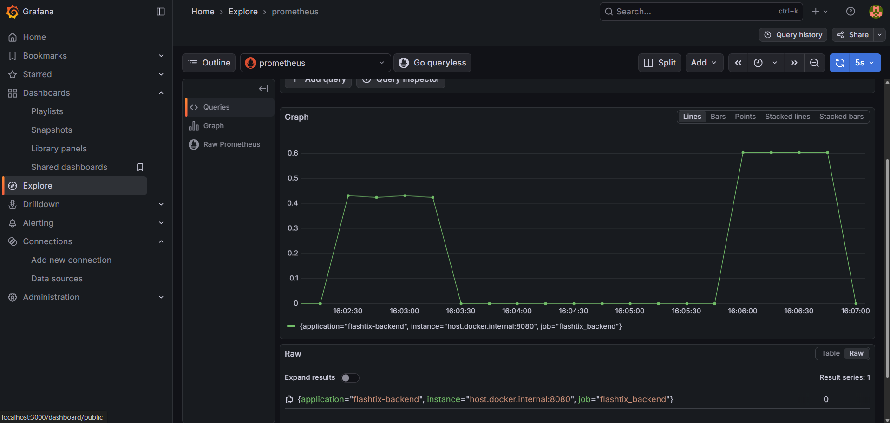

```markdown
# ⚡ FlashTix - High-Performance Ticketing Engine

    

**FlashTix** is an enterprise-grade backend system engineered to handle massive traffic surges (e.g., flash sales) while guaranteeing **strict data consistency**.

Unlike typical CRUD apps, FlashTix solves the **"Double Booking Problem"** using a multi-layered concurrency strategy, ensuring that **exactly one user** can book a specific seat even under a load of 500+ concurrent requests per second.

---

## 📊 Proof of Work: Real-Time Observability
*The system doesn't just "run"; it provides real-time telemetry on lock contention and system health.*



| Metric | Result | Description |
| :--- | :--- | :--- |
| **Concurrency Load** | **500 Threads** | Simulating 500 users hitting `/book` simultaneously. |
| **Success Rate** | **1 Booking** | Exactly one user acquired the ticket. |
| **Rejection Rate** | **499 Rejections** | 99.8% of requests were correctly rejected (HTTP 409). |
| **Data Integrity** | **100%** | No race conditions or dirty writes detected. |

---

## 🏗️ System Architecture: The "Defense-in-Depth" Strategy

The system processes booking requests through a rigorous pipeline to protect the database from being overwhelmed.

```mermaid
graph TD
    User[User Request] -->|POST /book| API[Booking Service]
    
    subgraph "Observability Layer"
        API -.->|Record Metrics| Micrometer[Micrometer]
        Micrometer -->|Scrape| Prom[Prometheus]
        Prom -->|Visualize| Grafana[Grafana Dashboard]
    end

    subgraph "Layer 1: Redis Distributed Lock"
        API -->|SETNX (Lua Script)| Redis{Acquire Lock?}
        Redis -- No --> Reject[409 Conflict: fast-fail]
    end
    
    subgraph "Layer 2: Database Optimistic Locking"
        Redis -- Yes --> DB[PostgreSQL Transaction]
        DB -->|Check @Version| Verify{Version Match?}
        Verify -- No --> Rollback[OptimisticLockException]
        Verify -- Yes --> Commit[Success: Ticket Booked]
    end

```

### 1. Redis Distributed Lock (The Gatekeeper)

* **Tech:** Redis `SETNX` + Lua Scripting.
* **Function:** Acts as a high-speed semaphore. It creates a "queue-like" effect where only one request per ticket ID can proceed to the database.
* **Safety:** Implemented with a **TTL (Time-To-Live)** to prevent deadlocks if the application crashes mid-process. Unlock operations use atomic Lua scripts to ensure ownership.

### 2. Optimistic Locking (The Final Guard)

* **Tech:** JPA `@Version`.
* **Function:** A database-level fail-safe. If a Redis key is evicted or a split-brain occurs, the database prevents overwrites by checking the version number of the row before committing.

---

## 🚀 Tech Stack

* **Core:** Java 17, Spring Boot 3.4
* **Database:** PostgreSQL (Tuned with HikariCP for connection pooling)
* **Caching & Locking:** Redis (Lettuce Client)
* **Observability:**
* **Prometheus:** Scrapes metrics from Spring Actuator.
* **Grafana:** Visualizes throughput, lock contention, and DB pool usage.
* **Micrometer:** Custom metrics (`flashtix.sold.out`) to track business-logic failures.


* **Testing:** JUnit 5, Java HTTP Client (for external load testing), ExecutorService.
* **Containerization:** Docker & Docker Compose.

---

## 🛠️ How to Run

### 1. Start Infrastructure

Spin up PostgreSQL, Redis, Prometheus, and Grafana using Docker Compose.

```bash
cd backend
docker-compose up -d

```

### 2. Run the Application

Start the Spring Boot application.

```bash
./mvnw spring-boot:run

```

### 3. Access Interfaces

* **Swagger UI:** [http://localhost:8080/swagger-ui.html](https://www.google.com/search?q=http://localhost:8080/swagger-ui.html)
* **Grafana:** [http://localhost:3000](https://www.google.com/search?q=http://localhost:3000) (Login: `admin` / `admin`)
* **Prometheus:** [http://localhost:9090](https://www.google.com/search?q=http://localhost:9090)

---

## 🧪 Running the Stress Test

To replicate the results shown in the "Proof of Work" section:

**1. Seed the Database**
Creates 100 fresh tickets.

```bash
curl -X POST http://localhost:8080/api/tickets/seed

```

**2. Launch the Attack**
Runs `ApiLoadTest.java`, which fires **500 concurrent HTTP requests** against the running server.

```bash
./mvnw test -Dtest=ApiLoadTest

```

**3. View Results**
Check the logs for `Sold Out Errors: 499` and view the spike on the Grafana dashboard.

---

## 👨‍💻 Author

**Mohd Arshad**
Backend Engineer | [LinkedIn](https://www.google.com/search?q=https://www.linkedin.com/in/mohd-arshad-156227314/)

```

```